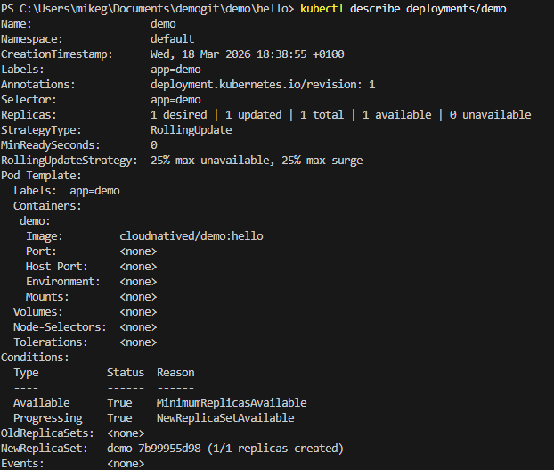
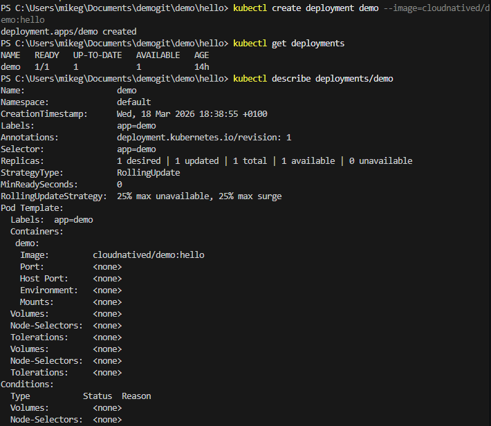
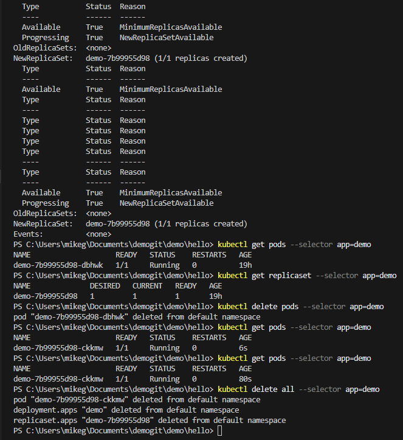
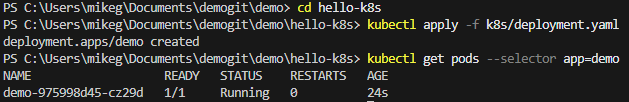
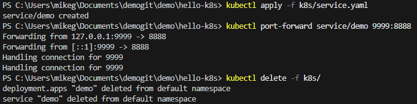
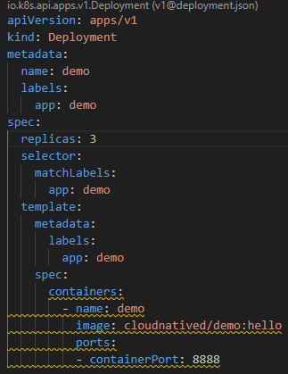
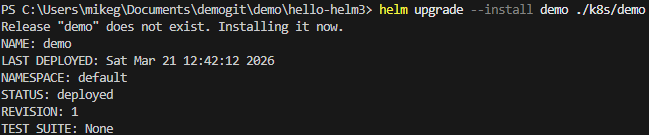
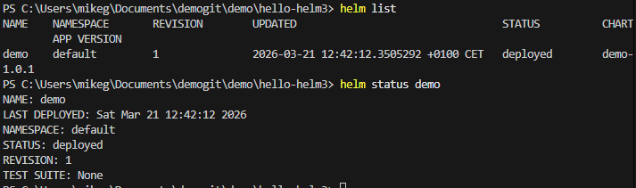

## Création de Déploiements (Deployments)

## Maintien de l'état souhaité
[text](lab2-working-with-kubernetes-object.md)

## Utilisation de `kubectl apply`

## Ressources de Service

## Exercice

## Installation d'un chart Helm

## Liste des releases Helm

