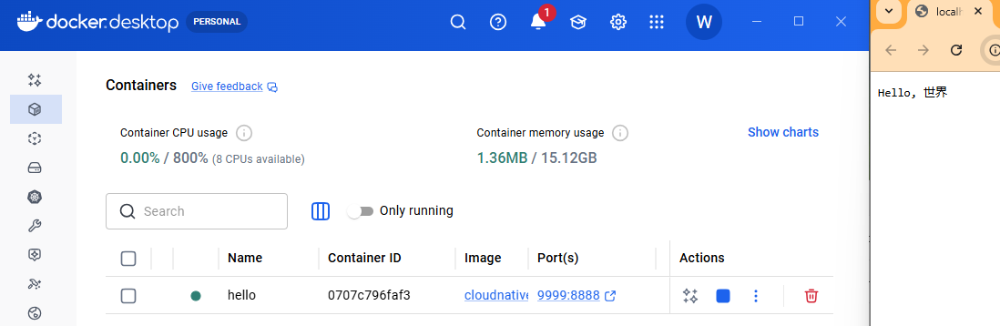
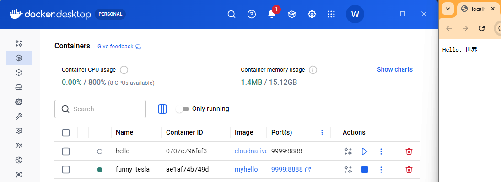
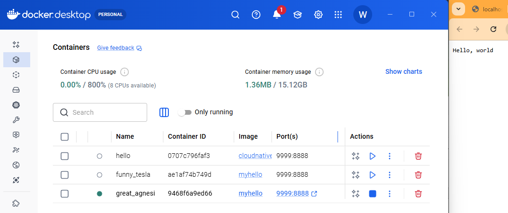
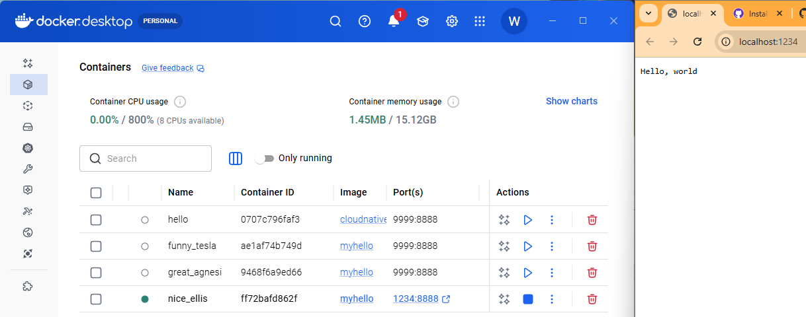
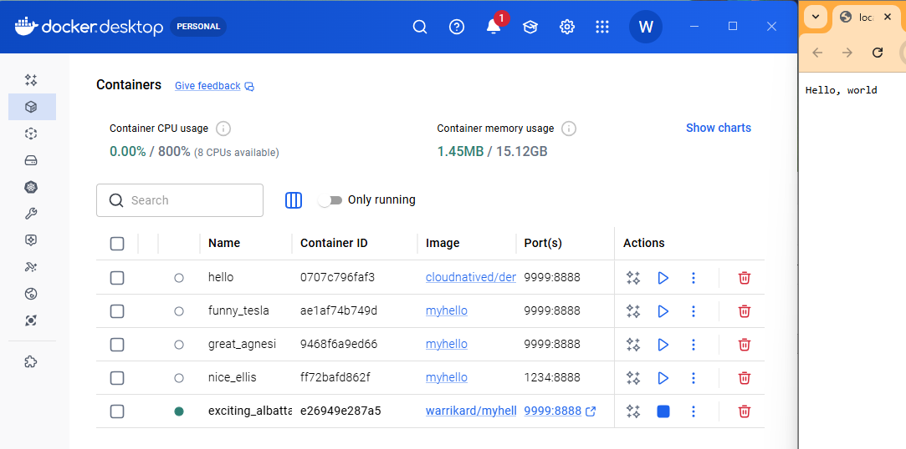
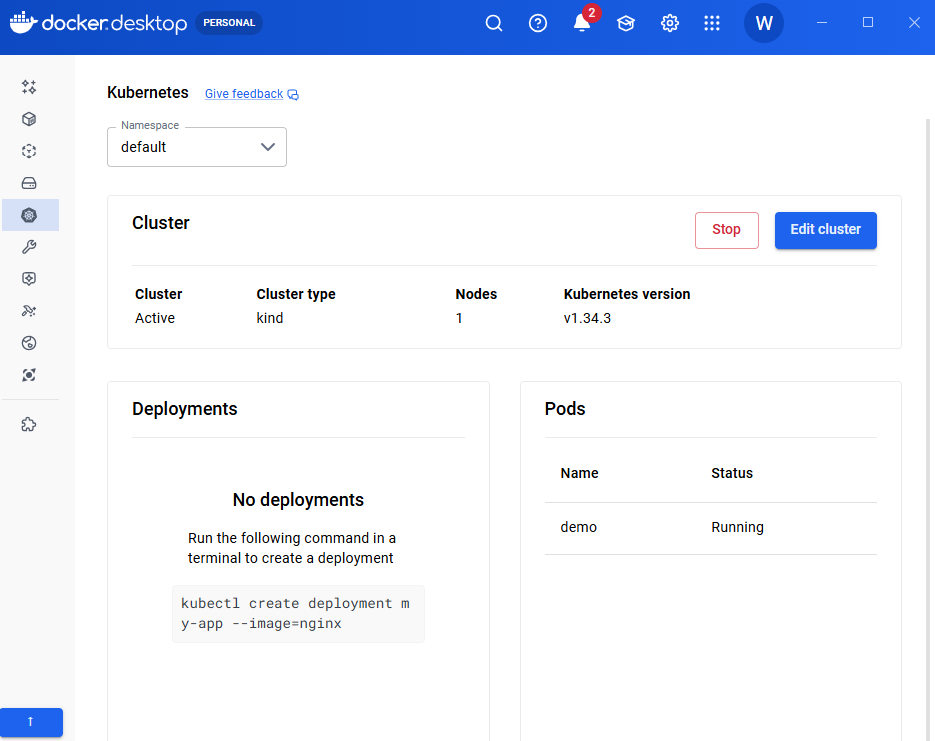
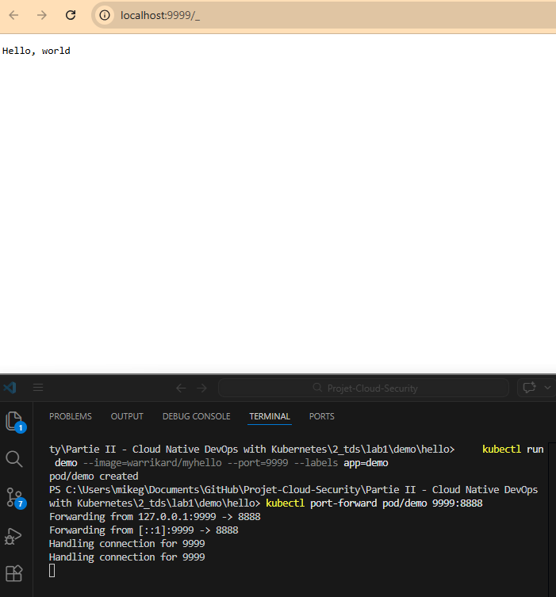

# lancement du docker demo

# Creation image myhello

# Exercice

# changer port

# Connexion ID
docker login        
Authenticating with existing credentials... [Username: warrikard]
i Info → To login with a different account, run 'docker logout' followed by 'docker login'
Login Succeeded

# push image
docker image push warrikard/myhello
Using default tag: latest
The push refers to repository [docker.io/warrikard/myhello]
7b4e15e4c7fd: Pushed
924d0f7a9be3: Pushed
latest: digest: sha256:04245b7f615e762611927cb6514425e80bc663fed9fb11eeacbf89a0e25a2618 size: 855

# Exécution de l'application de démonstration

kubectl port-forward pod/demo 9999:8888
Forwarding from 127.0.0.1:9999 -> 8888
Forwarding from [::1]:9999 -> 8888
Handling connection for 9999
Handling connection for 9999

